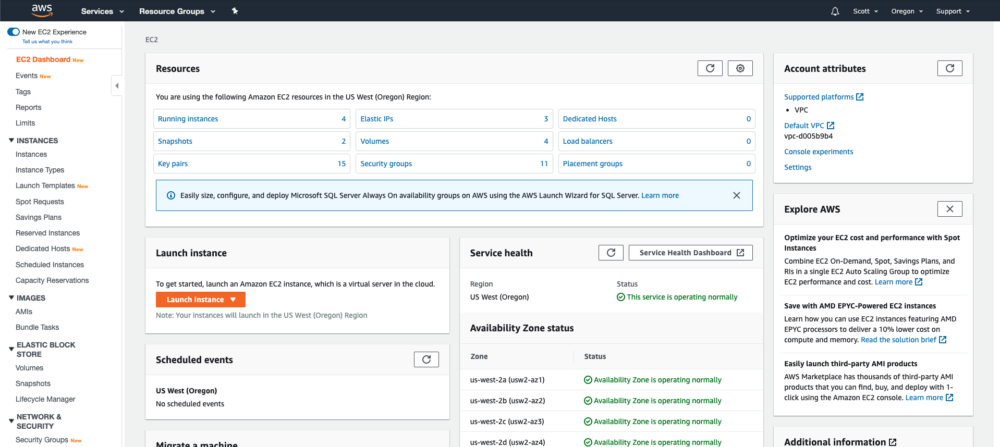
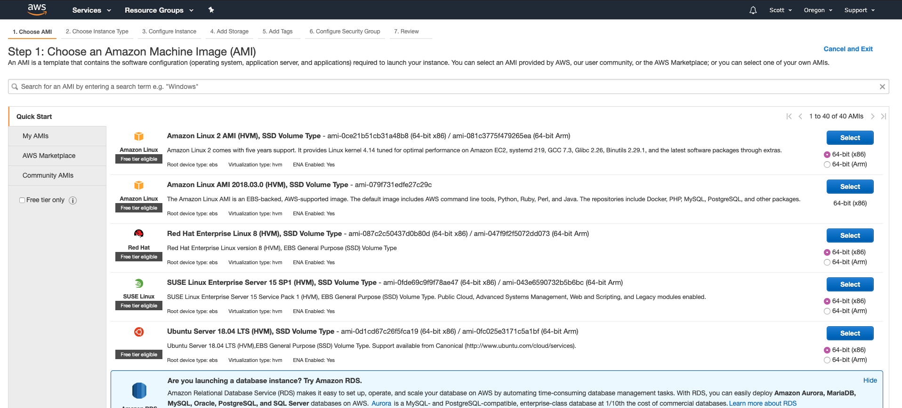
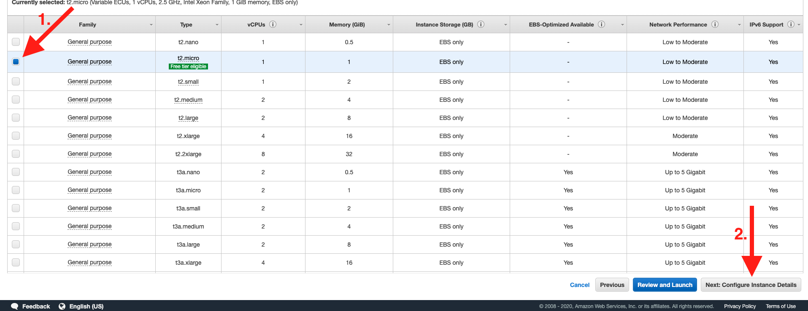
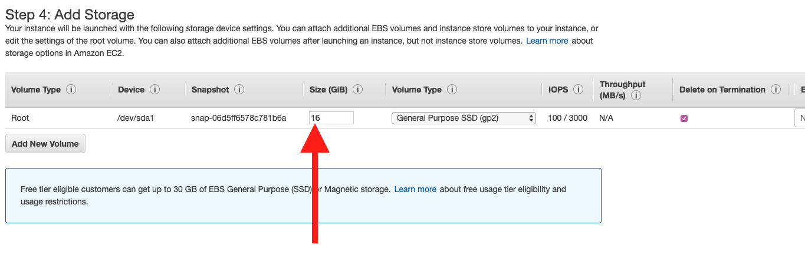
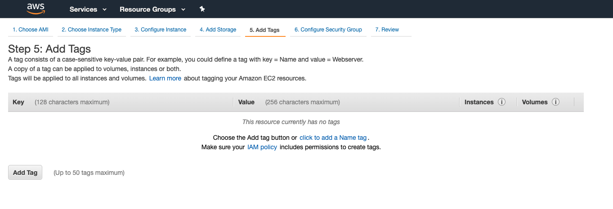

# AWS EC2 Initial Setup

This guide will walk you through setting up an EC2 (Free Tier) Instance on AWS.

1. In your browser navigate to [https://aws.amazon.com](https://aws.amazon.com).
    - **NOTE:** If you have not already created an aws account, do so now. This will require a credit card but nothing this guide walks you through will cost anything for the first year. If you choose to let your server continue to run after a year it will cost approximately $10 a month after the first year.
1. Click the `Sign in to the console` button to sign in.
    - It is located in the nav bar in the top right of the screen.
1. Once signed in you will be looking at a list of all the different AWS services. Under `ALL services` locate the `Compute` section and click on `EC2`.
    # 
1. You should now be on the EC2 Dashboard page, that looks something like:
    - **NOTE** Yours will probably have zeros for the different resources under the **Resources** section, this is expected.
    # 
1. Click on the orange `Launch Instance` button. From the button's dropdown select `Launch Instance`.
    # 
1. You should now be on the **"Step 1: Choose an Amazon Machine Image (AMI)"** page. This page is where you select what operating system you want your instance to have.
    # 
1. Locate **Ubuntu Server 18.04 LTS (HVM), SSD Volume Type** in the list of available options. Then select it by clicking on the blue `Select` button.
    # 
1. You should now be on the **"Step 2: Choose an Instance Type"** page. This page is where you select how powerful of a machine you need.
    # 
1. Ensure that `t2.micro` is selected and then in the bottom right of the screen click `Next: Configure Instance Details`.
    # 
1. You should now be on the **"Step 3: Configure Instance Details"** page. This page is for the configuration of your instance.
    # 
1. **DO NOT** change anything on this page, the defaults are good. Click `Next: Add Storage` in the bottom right of the screen.
    # 
1. You should now be on the **"Step 4: Add Storage"** page. This page is where you select your hard drive size and type.
    # 
1. Change the storage `Size (GiB)` from `8` to `16`.
    # 
1. Click `Next: Add Tags` in the bottom right corner.
    # 
1. You should now be on the **"Step 5: Add Tags"** page.
    # 
1. There is nothing to do on this page. Click the `Next: Configure Security Group` button.
    # 
1. You should now be on the **"Step 6: Configure Security Group"** page. This page is where you configure your instances firewall. You can set which ports have access to your instance and from which IP addresses.
    # 
1. Click the `Add Rule` button. On the newly added rule select `HTTP` under type. This will allow access to and from your instance on port 80.
    # 
    # 
1. Click the `Add Rule` button again. On the newly added rule select `HTTPS` under type. This will allow access to and from your instance on port 443.
    # 
    # 
1. Click the `Review and Launch` button in the bottom right corner.
    # 
1. You should now be on the **"Step 7: Review Instance Launch"** page. Compare your settings to the image below. The most important sections are shown in the image: AMI Details, Instance Type, and Security Groups.
    # 
1. Once you have ensured everything is correct, click the blue `Launch` button in the bottom right corner.
    # 
1. You should see a modal pop up that says **"Select an existing key pair or create a new key pair"**. 
    ### THESE STEPS ARE VERY IMPORTANT!! Without this file you can not access your server!
    1. In the first dropdown select **"Create a new key pair"**.
    1. In the input give your key pair a name, name it `profile-server`.
        - **NOTE** You can name it something different just be aware it will change some of the below commands. Any command that references the key file needs to match whatever name you choose. If this is your first time you should stick with the suggested name: (`profile-server`)
    1. Click the `Download Key Pair` button.
    # 
1. Move your newly created key file to your home directory
    ### ON MAC or LINUX
    1. Open your terminal.
        - **NOTE:** When you open your terminal, you always start in your home directory. However you can always type `cd` then press `enter`, that will always take you back to your home directory.
    1. Move your key file to your home directory. Run the following command from your home directory:
        - `mv Downloads/profile-server.pem .`
    1. Verify the file was moved successfully. Run the following command and verify you see the `profile-server.pem` file listed.
        - `ls`
    1. Change the permissions for the file
        - `chmod 600 profile-server.pem`
    ### ON Windows
    1. Open your bash terminal
        - **NOTE:** Use the bash terminal not the command line
    1. Ensure you are in your home directory:
        - Type `cd` then press `enter`
    1. Move your key file to your home directory. Run the following command from your home directory:
        - `mv Downloads/profile-server.pem .`
    1. Verify the file was moved successfully. Run the following command and verify you see the `profile-server.pem` file listed.
        - `ls`
    1. On Windows you DO NOT need to change the file permissions.
1. Go back to your browser, click the blue `Launch Instances` button.
    # 
1. You should now be on the **"Launch Status"** page.
    # 
1. Click the blue `View Instances` button on the right.
1. You should now be on the instances page
    - **NOTE** You will probably only have one instance listed
    # 
