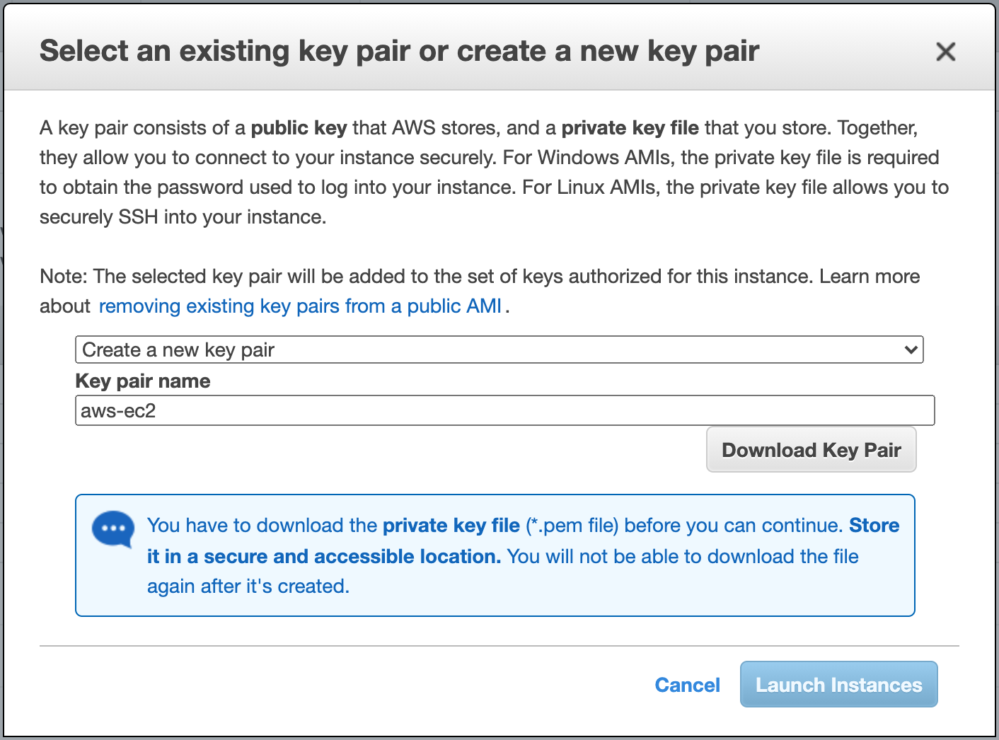
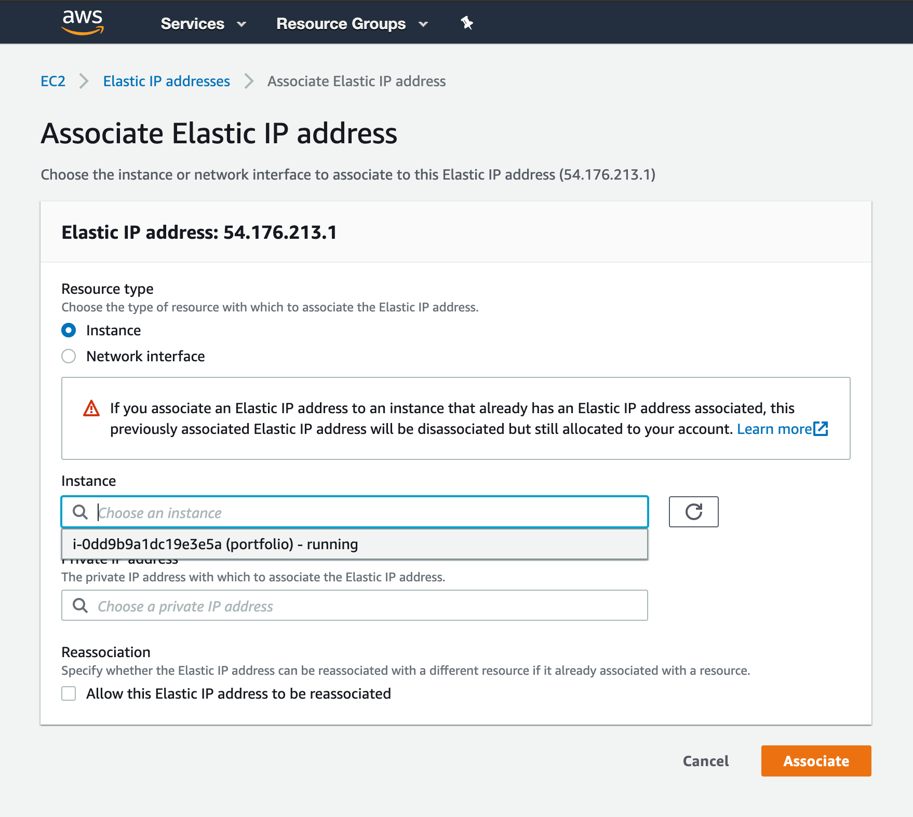

# AWS EC2 Initial Setup

This guide will walk you through provisioning a (Free Tier) EC2 instance on Amazon Web Services.

1. In your browser navigate to [https://aws.amazon.com](https://aws.amazon.com).
    - **NOTE:** If you have not already created an AWS account, do so now. This will require a credit card but nothing in this guide will cost anything for 12 months. If you continue to use your EC2 instance after a year it will cost approximately $10 per month.
1. In the navbar at the top-right of the screen, click the **Sign in to the console** button to sign in.
1. Once signed in you will be looking at the complete list of different AWS services. Locate the **Compute** section of **All services** and click on **EC2**.

    

1. You should now be on the EC2 Dashboard page, that looks something like the following image:
    - **NOTE:** Yours will probably have zeros for the different resources under the **Resources** section.

    

1. Click on the orange **Launch Instance** button. From the button's dropdown select **Launch Instance**.

    

1. You should now be on the **Step 1: Choose an Amazon Machine Image (AMI)** page. This page is where you select the operating system of your EC2 instance.

    

1. Locate **Ubuntu Server 18.04 LTS (HVM), SSD Volume Type** in the list of available options. Then select it by clicking on the blue **Select** button.

    

1. You should now be on the **Step 2: Choose an Instance Type** page. This page is where you select the power level of your instance.

    

1. Ensure that **`t2.micro`** is selected and then in the bottom right of the screen click **Next: Configure Instance Details**.

    

1. You should now be on the **Step 3: Configure Instance Details** page. This page is for the configuration of your instance.

    

1. **DO NOT** change anything on this page, the defaults are good. Click **Next: Add Storage** in the bottom right of the screen.

    

1. You should now be on the **Step 4: Add Storage** page. This page is where you select your hard drive size and type.

    

1. Change the storage **Size (GiB)** from `8` to `16`.

    

1. Click **Next: Add Tags** in the bottom right corner.

    

1. You should now be on the **Step 5: Add Tags** page.

    

1. There is nothing to do on this page. Click the **Next: Configure Security Group** button.

    

1. You should now be on the **Step 6: Configure Security Group** page. This page is where you configure your instance's firewall. You can set which ports are open to your instance and from which IP addresses.

    

1. Click the **Add Rule** button. On the newly added rule select `HTTP` under **Type**. This will allow access to and from your instance on port `80`.

    
    

1. Click the **Add Rule** button again. On the newly added rule select `HTTPS` under **Type**. This will allow access to and from your instance on port `443`.

    
    

1. Click the **Review and Launch** button in the bottom right corner.

    

1. You should now be on the **Step 7: Review Instance Launch** page. Compare your settings to the image below. The most important sections are shown in the image: AMI Details, Instance Type, and Security Groups.

    

1. Once you have ensured everything is correct, click the blue **Launch** button in the bottom right corner.

    

1. You should see a modal pop up that says **Select an existing key pair or create a new key pair**.
    ### THESE STEPS ARE VERY IMPORTANT!! Without this file you cannot access your EC2 instance!
    1. In the first dropdown select **Create a new key pair**.
    1. In the input give your key pair a name. Name it `aws-ec2`.
        - **NOTE** You can name it something different just be aware it will change some of the below commands. Any command that references the key file needs to match whatever name you choose. If this is your first time you should stick with the suggested name: (`aws-ec2`)
    1. Click the **Download Key Pair** button to get your `aws-ec2.pem` file.

    

1. Move your newly created key file to your home directory
    ### On macOS or Linux
    1. Open **Terminal** and navigate to your home directory.
        - `cd ~`
    1. Move your key file to your home directory with the following command:
        - `mv ~/Downloads/aws-ec2.pem ~/aws-ec2.pem`
    1. Verify that the file was moved successfully. Run the following command and verify you see the `aws-ec2.pem` file listed.
        - `ls ~`
    1. Change the permissions for the file
        - `chmod 600 aws-ec2.pem`
    ### On Windows
    1. Open **Git Bash** and navigate to your home directory.
        - `cd ~`
    1. Move your key file to your home directory with the following command:
        - `mv ~/Downloads/aws-ec2.pem ~/aws-ec2.pem`
    1. Verify that the file was moved successfully. Run the following command and verify you see the `aws-ec2.pem` file listed.
        - `ls ~`
    1. On Windows you do not need to change the file permissions.
1. Go back to your browser, click the blue **Launch Instances** button.
1. You should now be on the **Launch Status** page.

    

1. Click the blue **View Instances** button on the right.
1. You should now be on the instances page
    - **NOTE:** You will probably only have one instance listed.

    

1. Hover over your instance in the table, in the name column, and a pencil icon should appear. Click the pencil to edit your instance's name. Name it **portfolio**.

    
    

1. In the left hand menu find the **Network & Security** section, click on the **Elastic IPs** link.

    

1. On the **"Elastic IP addresses"** page, click on the orange **Allocate Elastic IP address** button.

    

1. On the **Allocate Elastic IP address** page, click the orange **Allocate** button on the bottom right of the page.
    - **NOTE:** Your version of this page may look a little different than the image below.

    

1. You should now see this page with a green success message box at the top that says **Elastic IP address allocated.**

    

1. Write down your new IP address, you will need it again.

    

1. Click on the **Actions** button in the top right of the page, then click on the **Associate Elastic IP address** option.

    

1. On the **Associate Elastic IP address** page, click on the **Instance** input then select your instance it should say **(portfolio)** next to its ID.

    

1. Click the orange **Associate** button at the bottom right of the page.

    

1. In the left side menu under the **Instances** section click on the **Instances** link.

    

1. In the table of the **Instances** view you should see your Elastic IP Address associated with your instance. You may need to scroll to the left depending on your screen size.

    

1. Now it's time to log into your instance!
    - ### macOS or Linux
        - Open **Terminal**
    - ### Windows
        - Open **Git Bash**
    - Run the following command in your terminal, but use the Elastic IP address you allocated instead:
        - `ssh -i ~/aws-ec2.pem ubuntu@52.13.121.237`
    - Type `yes` you want to continue and press enter.
    - If everything worked you should see the following output in your terminal and your prompt should now say `ubuntu@ip-172-31-24-185:~$` *(Your IP may vary)*:
        

### NOTE: To log out of your instance type `exit` then press `enter`

## You are done! You have successfully set up an EC2 instance with an Ubuntu OS!

Now that you have completed your setup for your EC2 instance, please setup an "A record" using your new IP Address and "CNAME records" for any web applications you are ready to deploy by clicking [here.](./DNS_SETUP.md)
