# DNS Setup

This guide will walk you through setting up DNS records for your domain name.

Upon completion of adding your DNS records, check out the following guides to finish your deployments.

- [Deploying a Full Stack Application](https://github.com/Learning-Fuze/full-stack-project/blob/master/guides/DEPLOYMENT.md)
- [Deploying a Static Application](https://github.com/Learning-Fuze/memory_match/tree/master/guides/deployment)

## Adding an A Record

A Records are the most basic type of DNS record and are used to point a domain or subdomain to an IP address.  You only need to do this the first time you are setting up your EC2 instance.  Once you have allocated an Elastic IP address to your EC2 instance, you must add an `A Record` to have your domain name service point to ip address where your nginx server is hosted.

Adding an A Record on:
- [namecheap.com](#adding-an-a-record-on:-namecheap.com)
- [name.com](#adding-an-a-record-on:-name.com)
- [hover.com](#adding-an-a-record-on:-hover.com)

### Adding an A Record on: namecheap.com

1. Log in to namecheap.com and land on account page

1. Click `Manage` on the domain name that you want to point to your Elastic IP address.

    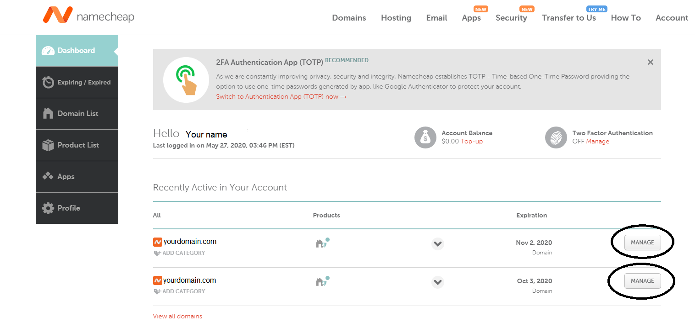

1. Click on `Advanced DNS`

    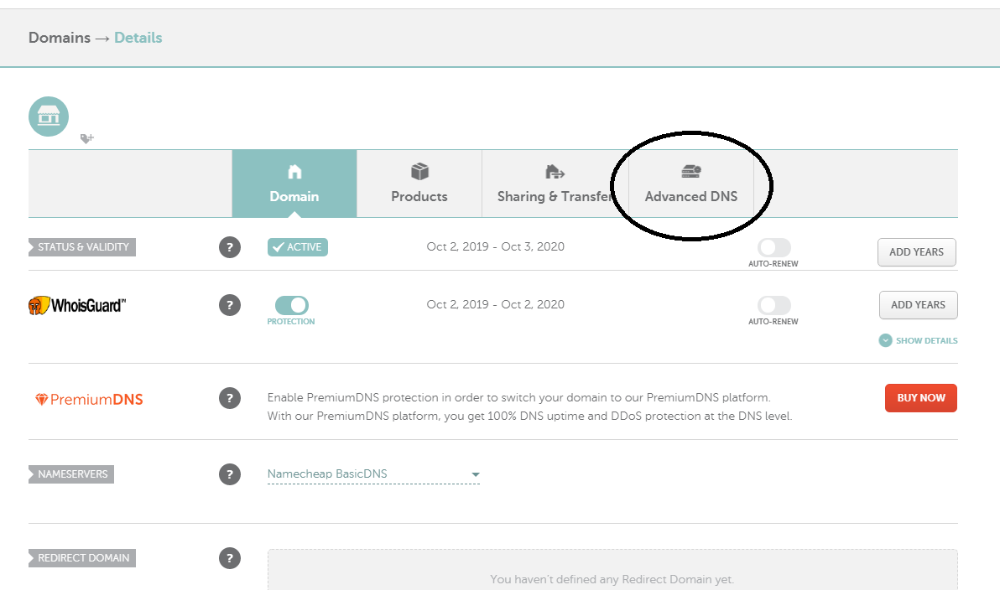

1. Click `Add New Record`

    

1. Click the green check mark once you have added the following fields

    1. Set the first drop down to `A Record`
    1. The second field is `@` (the @ symbol represents your root domain.)
    1. The third field is the Elastic IP address you allocated to your EC2 instance.

    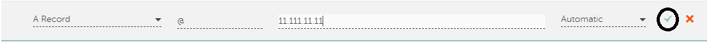

    [Adding a CNAME Record on: namecheap.com](#adding-a-cname-record-on:-namecheap.com)

### Adding an A Record on: name.com

1. Log in to name.com and land on the account page

1. Click on the domain name that you want to point to your Elastic IP address.

    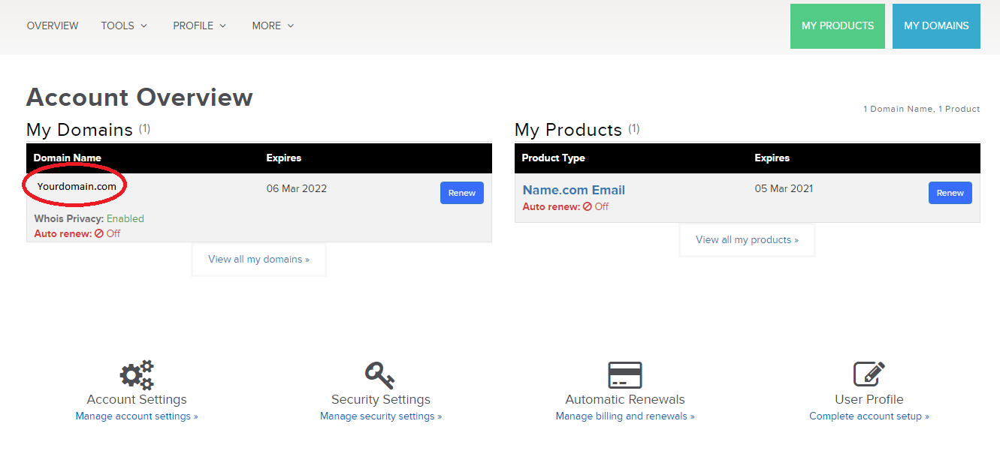

1. Click on `Manage DNS Records`

    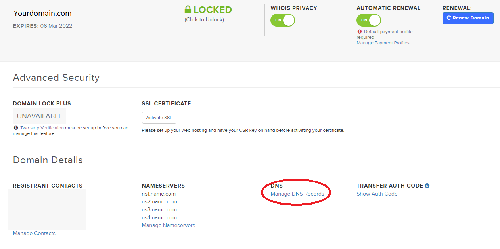

1. Click the blue `Add Record` button once you have added the following fields

    1. Set the first drop down to `A Record`
    1. The second field is your domain name
    1. The third field is the Elastic IP address you got from AWS.

    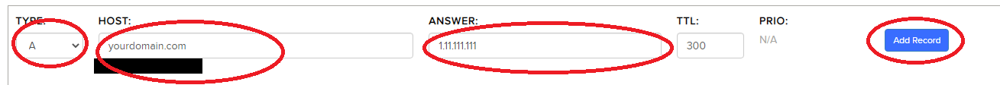

    [Adding a CNAME Record on: name.com](#adding-a-cname-record-on:-name.com)

### Adding an A Record on: hover.com

1. Log in to hover.com and land on the account page

1. Click on the edit drop down of the domain name that you want to point to your Elastic IP address.

    

1. Click on `Edit DNS`

    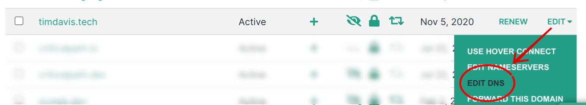

1. Click the `Add A Record` button.

    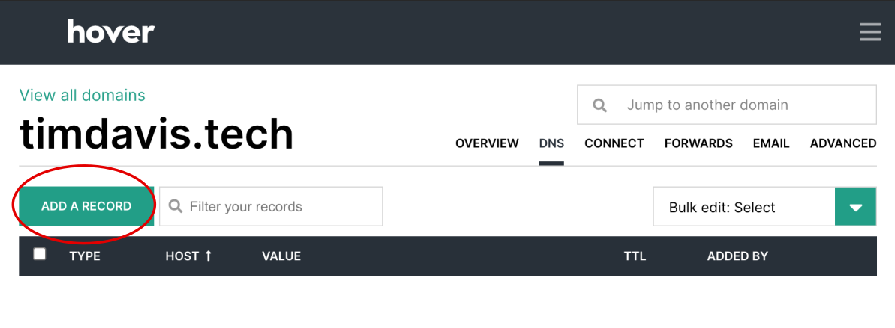

1. Click the `Add Record` after inputting the following data

    1. Set the `TYPE` drop down to `A`
    1. Set `HOSTNAME` to your domain name
    1. Set `IP ADDRESS` to the elastic ip address you got from aws.

    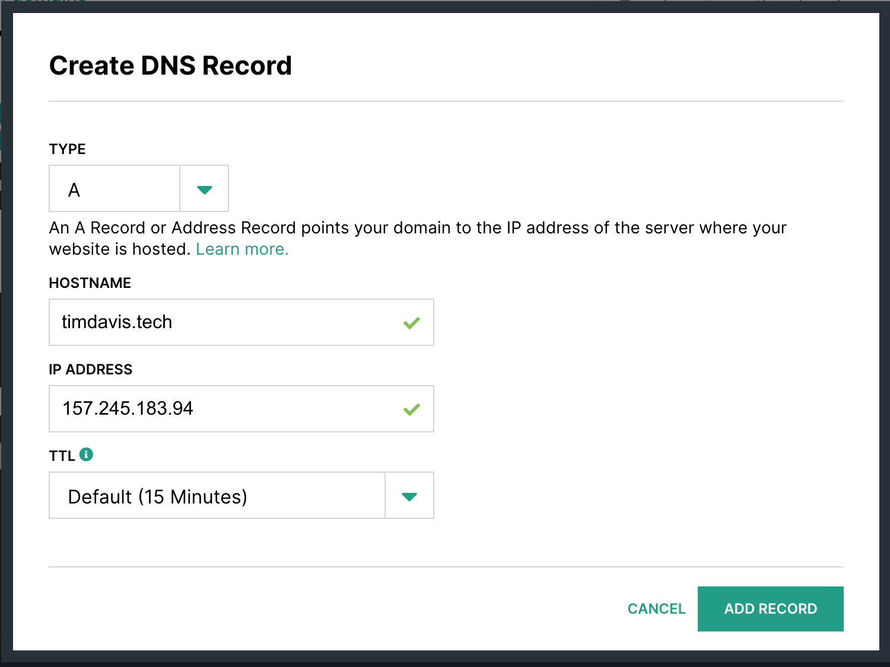

    [Adding a CNAME Record on: hover.com](#adding-a-cname-record-on:-hover.com)

___

## Adding a CNAME Record

The DNS CNAME record works as an alias for domain names that share a single IP address.  CNAME records tell DNS resolvers to use the same IP address as your A record. With multiple web applications, you create multiple CNAME records so if you ever have to change your IP address, you only have to do it once. Every time you want to deploy a web application for your portfolio, you will need to do this.

Adding a CNAME Record on:
- [namecheap.com](#adding-a-cname-record-on:-namecheap.com)
- [name.com](#adding-a-cname-record-on:-name.com)
- [hover.com](#adding-a-cname-record-on:-hover.com)

### Adding a CNAME Record on: namecheap.com

1. Log in to namecheap.com and land on account page

1. Click `Manage` on the domain name that you want to create the CNAME record for.

    

1. Click on `Advanced DNS`

    

1. Click `Add New Record`

    

1. Click the green check mark once you have added the following fields

    1. Set the first drop down to `CNAME Record`
    1. The second field is your subdomain.  For example if your address is `memory-match.yourdomainhere.com` then your subdomain would be `memory-match`.
    1. The third field is the root address of your domain. For example if your address is `memory-match.yourdomainhere.com` then your root would be `yourdomainhere.com`.

    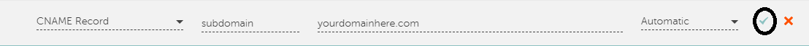

### Adding a CNAME Record on: name.com

1. Log in to name.com and land on the account page

1. Click on the domain name that you want to create the CNAME record for.

    

1. Click on `Manage DNS Records`

    

1. Click the blue `Add Record` button once you have added the following fields

    1. Set the first drop down to `CNAME`
    1. The second field is your domain name with the subdomain you want.
    1. The third field is the root address of your domain.

    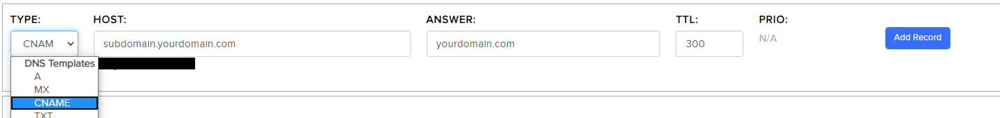

### Adding a CNAME Record on: hover.com

1. Log in to hover.com and land on the account page

1. Click on the edit drop down of the domain name that you want to create the CNAME record for.

    

1. Click on `Edit DNS`

    

1. Click the `Add A Record` button.

    

1. Click the `Add Record` after inputting the following data

    1. Set the `TYPE` drop down to `CNAME`
    1. Set `HOSTNAME` to your subdomain.  For example if your address is `memory-match.yourdomainhere.com` then your subdomain would be `memory-match`.
    1. Set `TARGET NAME` to the root address of your domain. For example if your address is `memory-match.yourdomainhere.com` then your root would be `yourdomainhere.com`..

    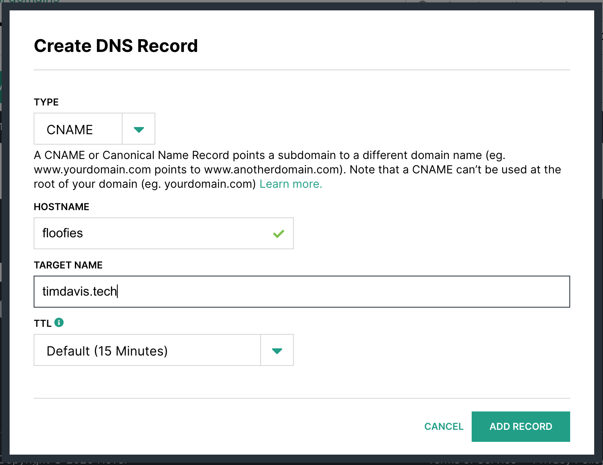
