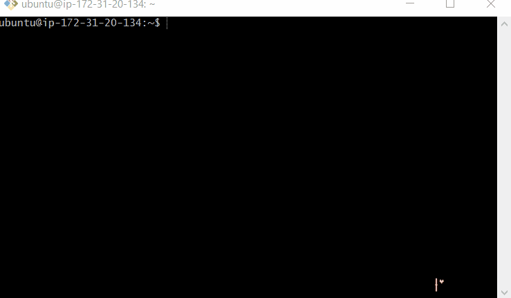
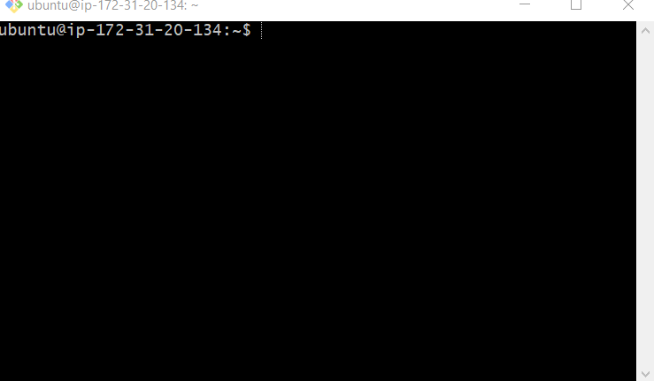

# Deploying a Front-End Web App to NGINX on an AWS EC2 Host w/Ubuntu 18.04

This guide outlines steps for deploying a web application without any custom back-end code to an NGINX web server running on an AWS EC2 instance with an Ubuntu 18.04 operating system. For instructions on how to deploy a full-stack application, please see the [Full-Stack Deployment Guide](FULL_STACK_DEPLOYMENT.md).

## Required Tools

This guide assumes that you have already [provisioned an AWS EC2 instance with SSH access](AWS_EC2_INITIAL_SETUP.md), with both [NGINX](INSTALL_NGINX_ON_UBUNTU.md) and [certbot](https://certbot.eff.org/lets-encrypt/ubuntubionic-nginx) installed on it. It also assumes you have already purchased a domain name.

### Create a Subdomain

Visit your domain name registrar and create a new `CNAME` DNS record for your project. The `CNAME` record should point to your main domain name.

> For example, if your domain name is `yourdomain.com` and your project's name is `code-journal`, then you'll create a `CNAME` record for `code-journal.yourdomain.com` that points to `yourdomain.com`.

For additional help on creating a subdomain, follow the [DNS setup guide](DNS_SETUP.md).

### Clone the Project

Connect to your EC2 instance over SSH.

For example:
```bash
ssh -i <location of pem file> ubuntu@<ip address>
```

<p align='center'>
    
<p>

Clone the project's source code into your home directory. Confirm that your current working directory is `/home/ubuntu` with the `pwd` command.

```bash
pwd
```

<p align='center'>
    
<p>

Ubuntu comes with `git` pre-installed so you can clone the project now. Replace `username` with the owner of the repository, `memory-match` with the name of the project, and `memory-match.yourdomain.com` with your project's subdomain. If the repository is private, then you'll be prompted for your GitHub username and password.

```bash
git clone https://github.com/username/memory-match memory-match.yourdomainhere.com
```

After the project is successfully cloned, running the `ls` command should show the project directory.

```bash
ls
```

<p align='center'>
    
<p>

The next few steps will be done from within the project directory, so change directories to the project. Replace `memory-match.yourdomainhere.com` with your subdomain.

```bash
cd memory-match.yourdomainhere.com
```

<p align='center'>
    
<p>

### Configure a Virtual Host for NGINX

When web browsers visit your project, they'll be making HTTP requests to your Nginx web server. However, Nginx doesn't know anything about your project by default. Therefor, a special configuration file needs to be created.

#### Copy the Template

Your starter files should have included a reference configuration in `guides/deployment/memory-match.example.conf`. Copy this file now, giving it a name that matches your project's subdomain.

> For example, if your project's subdomain is `memory-match.yourdomainhere.com`, then your configuration file's name should be `memory-match.yourdomainhere.com`. **There is no `.conf` at the end of the final file.**

**Note:** The default `ubuntu` user account of your EC2 instance does not have permission to modify files outside of its home directory, so the `cp` command will need to start with `sudo` to temporarily use the `root` user account.

```bash
sudo cp guides/deployment/memory-match.example.conf /etc/nginx/sites-available/memory-match.yourdomainhere.com
```

#### Edit the Configuration File

Now use `nano` to edit the copy you've created. Replace `memory-match.yourdomainhere.com` with your config file's name.

**Note:** The default `ubuntu` user account of your EC2 instance does not have permission to modify files outside of its home directory, so the `nano` command will need to start with `sudo` to temporarily use the `root` user account.

```bash
sudo nano /etc/nginx/sites-available/memory-match.yourdomainhere.com
```

Modify the `server_name` and `root` directives in the configuration file. For example, if your project name is `memory-match` and your domain is `yourdomainhere.com`, then your configuration file should look like this:

```conf
server {
    # The following server_name rule should equal the domain name for the
    # project, including sub-domain.
    server_name memory-match.yourdomainhere.com;

    # The following root rule should equal the full directory path of the
    # project's `index.html` file.
    root /home/ubuntu/$server_name;

    location / {
        try_files $uri $uri/ =404;
    }
}
```

#### Enable the Site

Once your configuration file has been edited, it's time to let Nginx know about it.

**Note:** The default `ubuntu` user account of your EC2 instance does not have permission to modify files outside of its home directory, so the `ln` command will need to start with `sudo` to temporarily use the `root` user account. Replace `memory-match.yourdomainhere.com` with your own configuration file's name.

1. Enable the site.
    ```bash
    sudo ln -s /etc/nginx/sites-available/memory-match.yourdomainhere.com /etc/nginx/sites-enabled/
    ```
1. Test your new configuration file. You should see confirmation messages that your configuration is valid.
    ```bash
    sudo nginx -t
    ```
1. Restart Nginx.
    ```bash
    sudo service nginx restart
    ```

#### Try it out!

Your project is now deployed! You should be able to visit your subdomain in a web browser to see the landing page of the app. If your domain has a `.dev` extension you need to complete the next step before viewing your website.  That is because the `dev` extension is a secure namespace, so you need HTTPS and an SSL certificate for your website to load on most browsers.

#### Enable SSL with Certbot

At this point, your web browser is not communicating with your application of a secure connection. Let's fix that! CertBot makes it easy to configure SSL for your project with one command.

**Note:** The default `ubuntu` user account of your EC2 instance does not have permission to run the `certbot` command, so it will need to begin with `sudo` to temporarily use the `root` user account.

```bash
sudo certbot --nginx
```

The following items may be requested of you by `certbot` if this is your first time running it:

1. Your _real_ email address is required for renewal and security notices.
1. You _must_ agree to the Let's Encrypt terms of service.
1. You _may_ opt to receive a newsletter from the EFF. You don't have to.
1. Choose your project for HTTPS activation.
1. Enable redirects to make all requests redirect to secure HTTPS connections.

#### Try it out again!!

Visit your subdomain again in a web browser and you should see a lock in the URL bar indicating that you are visiting the app over a private SSL connection!! 🔒🔒🔒

## Deploying Updates

"Redeploying" your project is required whenever fixes or new functionality has been added to its codebase. This process is much less involved than the initial deployment and the vast majority of it is simple repetition of some steps taken during your first deployment.

To get started, SSH into your EC2 instance.

### Pull the Latest Commits

Change directories to your project; it should be located at `/home/ubuntu/memory-match.yourdomainhere.com`. Change `memory-match.yourdomainhere.com` to your project's subdomain.

```bash
cd /home/ubuntu/memory-match.yourdomainhere.com
```

Pull the `master` branch of your GitHub repository.

```bash
git pull origin master
```

Now all of your most recent changes are downloaded!

### Done!

Congratulations, your project has bee redeployed. 🎉🎉🎉 **Note:** You may need to "Empty Cache and Hard Reload" in your browser to see the latest updates.
