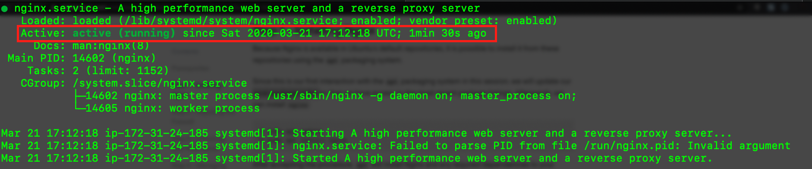
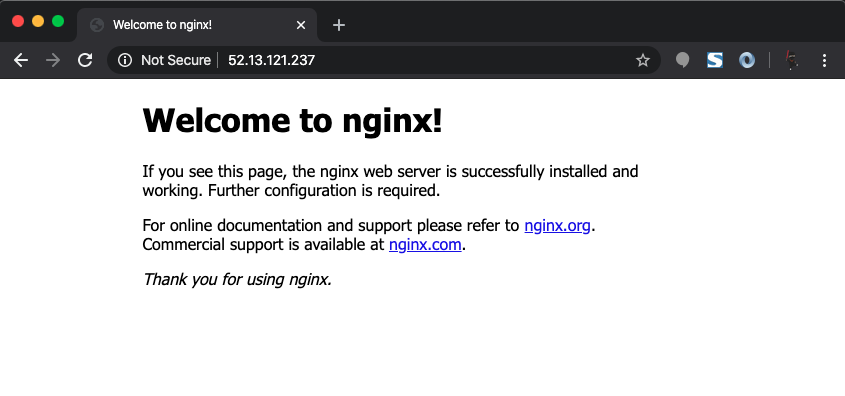

# Install Nginx on Ubuntu 18.04

This guide will walk you through setting up Nginx on Ubuntu 18.04. This guide assumes you have already setup an EC2 instance on AWS. If you have not already setup an EC2 instance follow the [AWS EC2 Initial Setup Guide](AWS_EC2_INITIAL_SETUP.md)

## Important note
  - **For MAc and Linux Users**
      - Use the terminal for this guide
  - **For Windows Users**
      - Use bash for this guide

## Install Nginx

1. Log into your EC2 instance *(If you are not already logged in)*
    - From your terminal run the following command, but use YOUR instance's IP address:
        - `ssh -i ~/aws-ec2.pem ubuntu@52.13.121.237`
1. Update your local package index by running the following command:
    - `sudo apt update`
1. Install Nginx
    - `sudo apt install nginx`
    - Answer `y` when asked if you want to continue
1. Check the status of the Nginx service to ensure it started properly
    - `sudo service nginx status`
    # 
    - Note the `"Active:"` line, it should say `"active (running)"`
1. In your browser, type your IP address in the address bar. You should see the following page:
    # 

### All done!, Nginx has been successfully installed on your EC2 instance.

In the next guide you will point a Domain name to your EC2 instance
